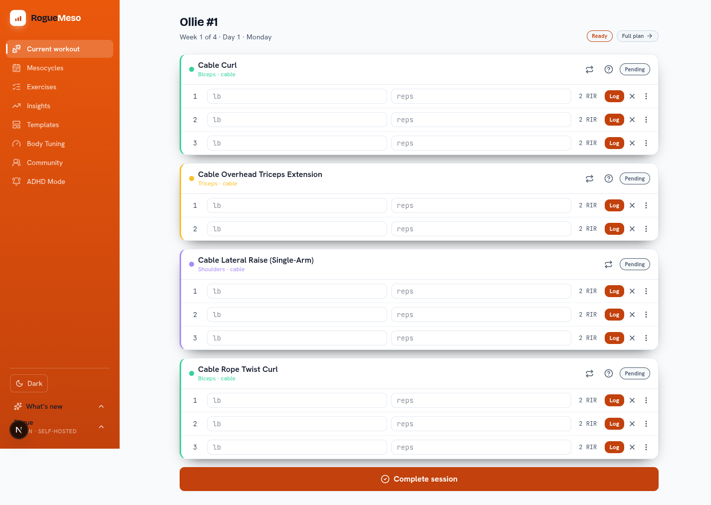
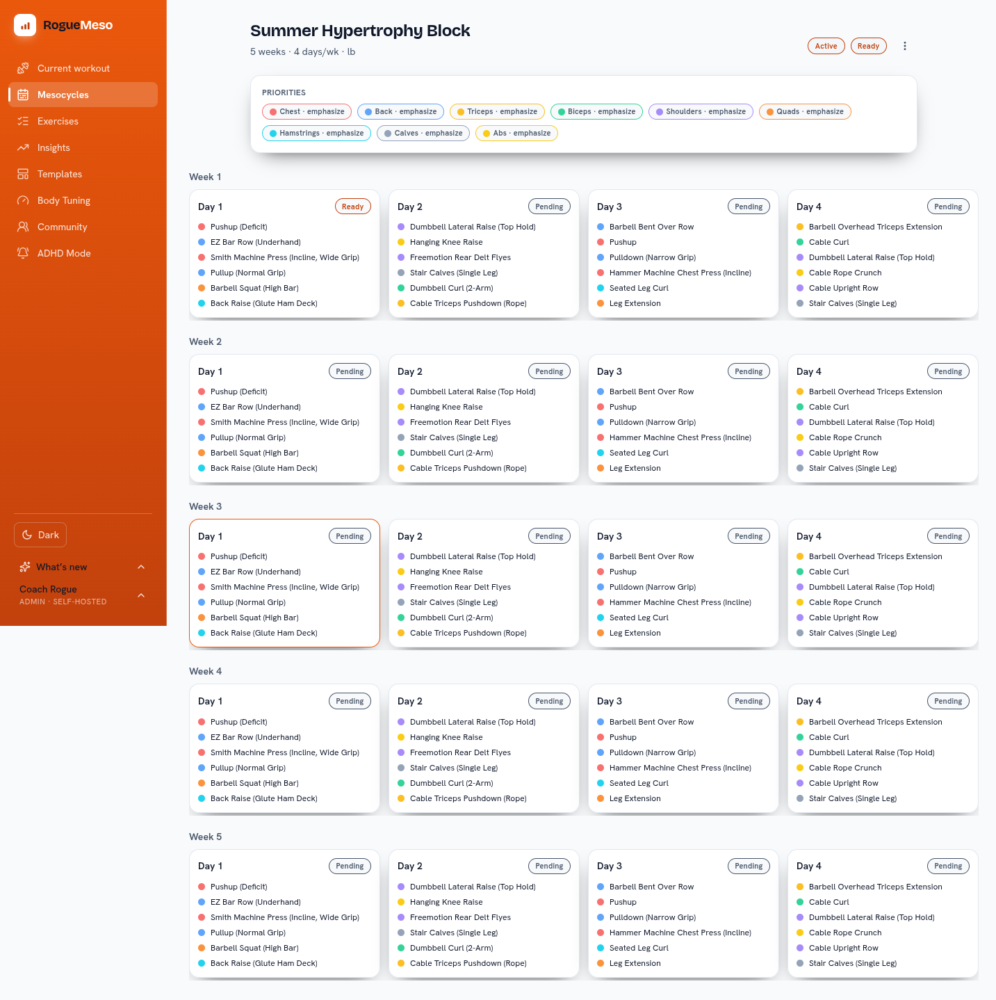
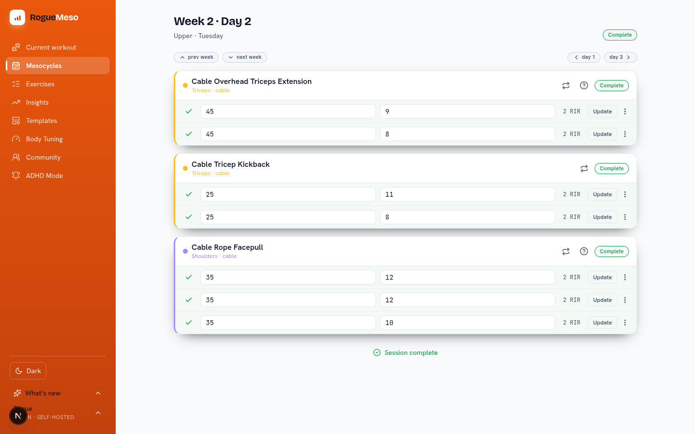
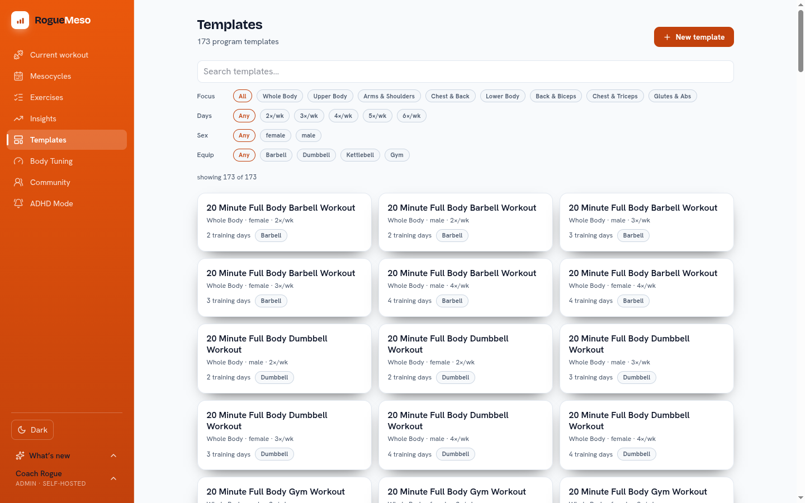
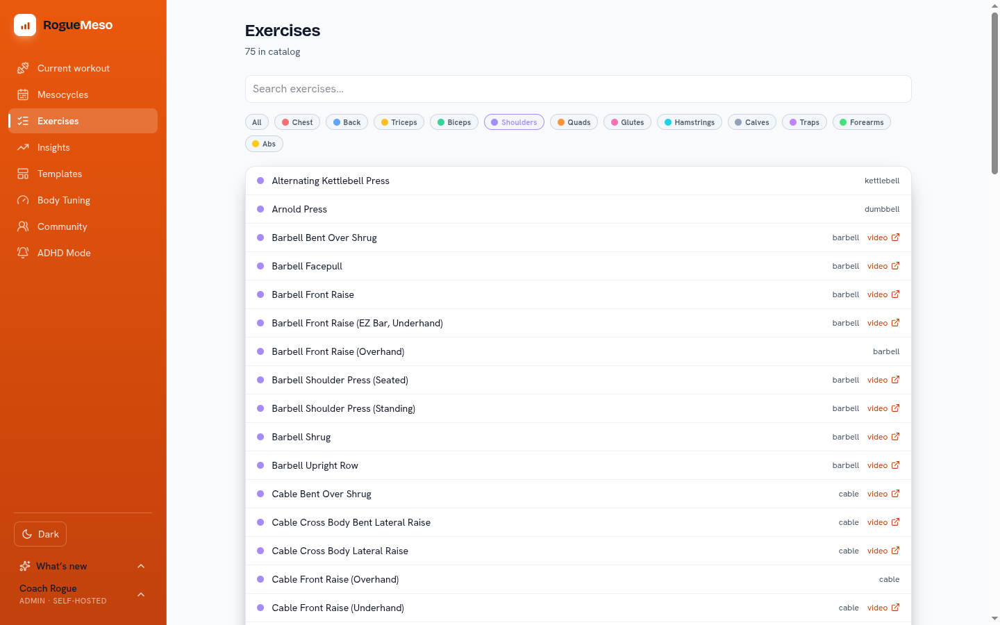
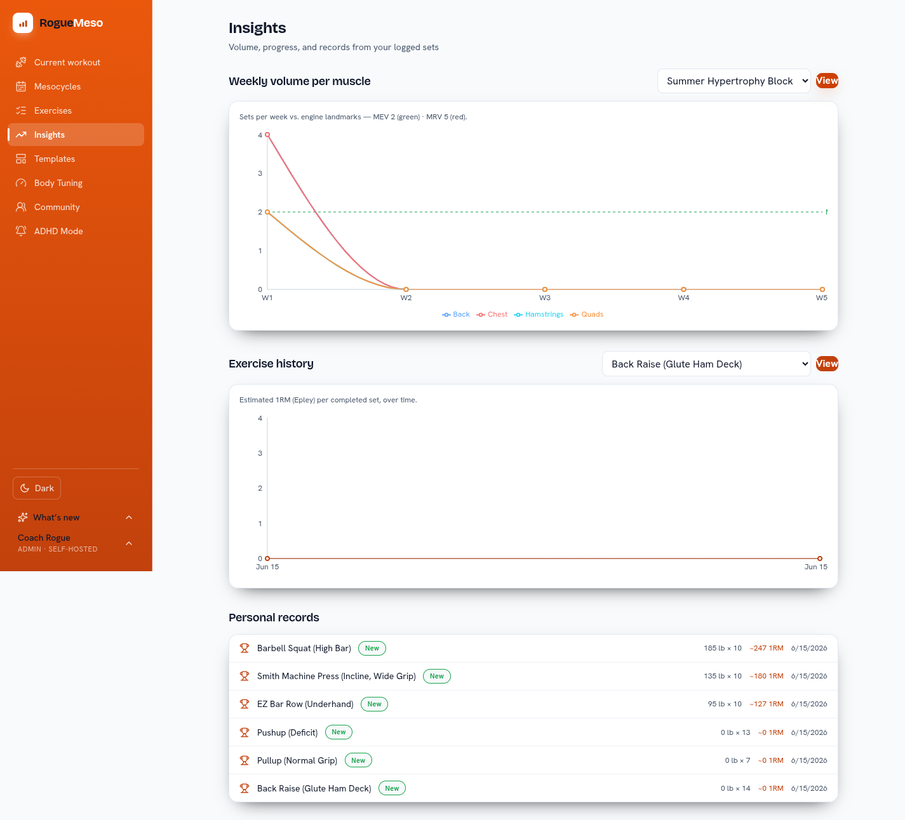
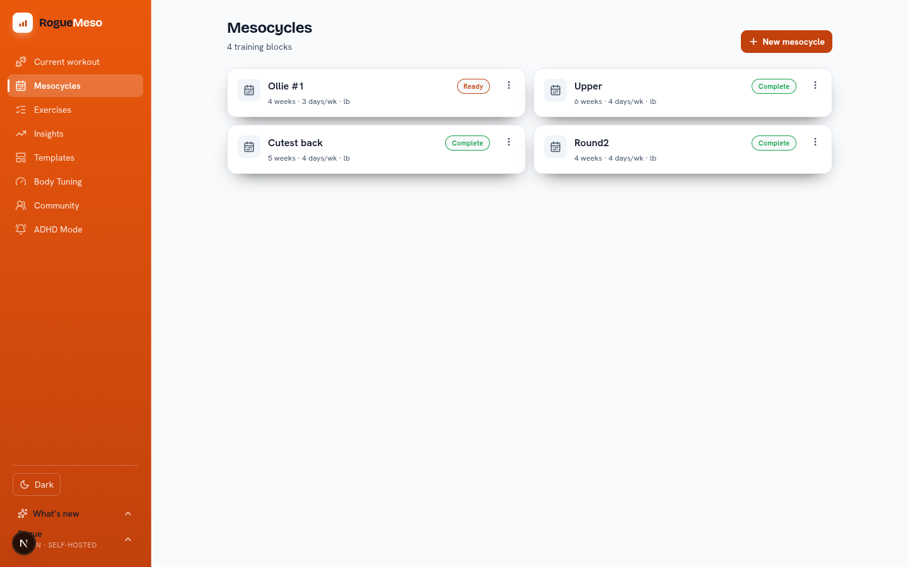
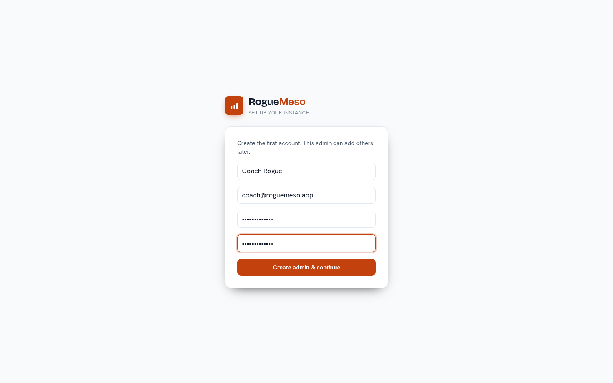
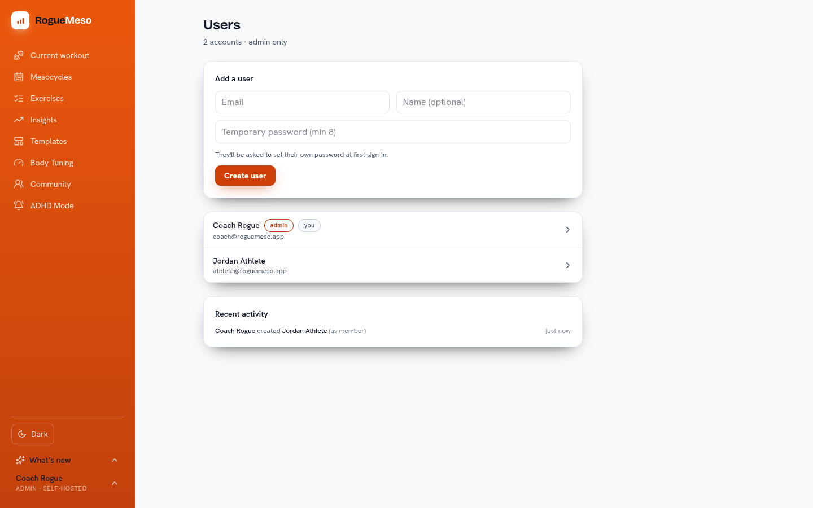
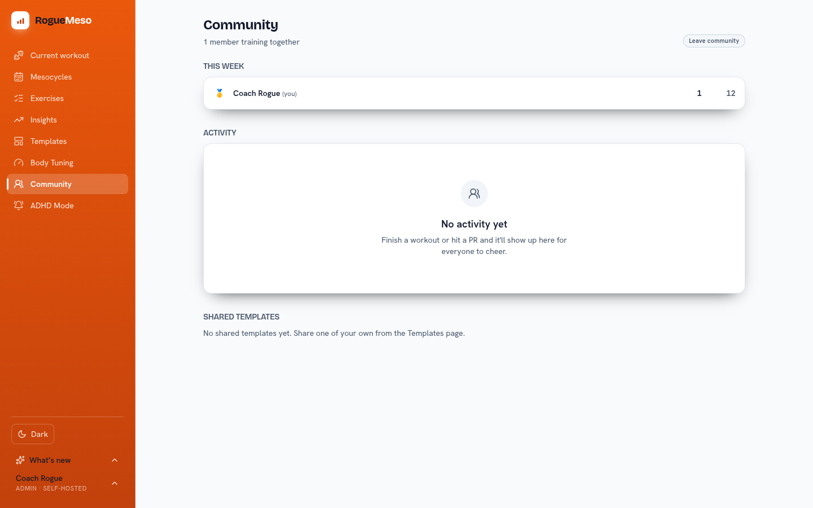

# RogueMeso

[](https://github.com/SaintedRogue/RogueMeso/actions/workflows/ci.yml)

A self-hosted hypertrophy training app — build mesocycles, log your sets with RIR targets,
and let the progression engine handle weekly volume/intensity and deloads. Multi-user for a
household: an admin provisions accounts, and each person's training data is private.

Built with Next.js 16, Postgres, and Prisma.

## Screenshots

> Light theme shown; the app defaults to dark and is fully responsive (mobile-first PWA with a bottom-tab nav).


<p align="center"><em>The current workout: log each set's weight, reps, and RIR against the engine's targets.</em></p>

| Mesocycle overview | Logging a session |
|:---:|:---:|
|  |  |
| The progression engine lays out every week and day, with per-muscle priorities. | A completed day — actuals logged against targets, set by set. |

| Program templates | Exercise library |
|:---:|:---:|
|  |  |
| 170+ starter programs (incl. kettlebell), filterable by focus, days/week, and equipment. | The full exercise catalog, filterable by muscle group with form-video links. |

| Insights & personal records | Your training blocks |
|:---:|:---:|
|  |  |
| Weekly volume vs. MEV/MRV landmarks, estimated-1RM trends, and a per-exercise personal-records table. | Every training block at a glance, each with an active/ready/complete status. |

| First-run setup | Multi-user management |
|:---:|:---:|
|  |  |
| On a fresh instance, create the first admin account — the setup screen then locks itself. | An admin provisions accounts (with temp passwords) and sees a recent-activity log. |


<p align="center"><em>The opt-in community — a weekly leaderboard, activity feed, and shared templates across everyone on the instance.</em></p>

## Stack

- **Next.js 16** (App Router, Server Actions, "Proxy" route protection)
- **Postgres 17** via Docker · **Prisma 6** ORM
- **Tailwind v4** UI · single-user-style cookie auth with per-user accounts (bcrypt)

## First run

```bash
# 1. Configure environment
cp .env.example .env
#    Edit .env: set the DB vars, then generate AUTH_SECRET with
#    node -e "console.log(require('crypto').randomBytes(32).toString('hex'))"
#    POSTGRES_PASSWORD is required — `docker compose up` fails fast if it's unset
#    (no weak default). Postgres is bound to 127.0.0.1 only, not the LAN.

# 2. Start Postgres + install deps
docker compose up -d
npm install

# 3. Apply the schema
npx prisma migrate deploy

# 4. (optional) Seed the reference data + template library
#    Load the committed snapshot (313 exercises, 153 templates):
psql "$DATABASE_URL" -f prisma/seed-data.sql
#    Then the additive kettlebell add-on (66 exercises, 20 programs) — idempotent,
#    safe on fresh or existing DBs; brings the live library to ~379 exercises / ~173 programs:
psql "$DATABASE_URL" -f prisma/kettlebell.sql
#    (The legacy `npm run db:seed` rebuilds the base snapshot from a SEED_DATA_DIR JSON export.)

# 5. Create the first admin account (uses ADMIN_* from .env)
npm run db:admin

# 6. Run
npm run dev   # http://localhost:3000
```

Sign in with the admin email/password, then provision additional users from
**Profile → Users** (admin only). `AUTH_SECRET` signs the session cookie.

## Data model

`MuscleGroup → Exercise` · `Template → TemplateDay → TemplateSlot` (+ priorities) ·
`Mesocycle → MesoDay → DayExercise → ExerciseSet` (+ priorities). Mesocycles and logged sets
are owned per user (`userId`); muscle groups, the exercise catalog, and templates with
`userId = null` form a shared library. Sets carry both targets (`weightTarget`/`repsTarget`/RIR)
and logged actuals, with a `status` workflow.

## Progression engine

`src/lib/progression.ts` — isolated and tunable: target RIR ramps to 0 with a final-week
deload, training volume rises MEV → MRV by muscle-group priority (maintain/grow/emphasize),
and working weights are clamped to a sane range. All constants live in one file so you can
adapt the model to your own methodology. See `src/lib/features/README.md` to extend.

## Deployment

The app ships as a self-contained Docker image that **bootstraps itself** on first
start: it waits for Postgres, applies Prisma migrations to build the schema, then —
only if the database is empty — loads the exercise + program-template library from
`prisma/seed-data.sql`. After that it applies two **idempotent additive** SQL files on
every boot: `prisma/descriptions.sql` (exercise form cues) and `prisma/kettlebell.sql`
(the kettlebell catalog + programs) — so even existing installs gain the kettlebell
library on their next update. No user accounts are seeded — on first visit the app shows a
one-time **setup screen** to create the admin account, then locks it; you start a fresh
mesocycle with the full library available. Every seed step is idempotent, so restarts
never duplicate data or clobber your edits.

```
docker-entrypoint.sh:  wait for DB → migrate deploy → seed if empty → backfill descriptions → apply kettlebell add-on → next start
```

### Unraid (two containers on br0)

The intended target. `deploy/unraid/` contains importable templates for the Postgres
and app containers plus a step-by-step guide — see **[`deploy/unraid/README.md`](deploy/unraid/README.md)**.
In short: `docker login ghcr.io` once on the server, import both XMLs via
**Docker → Add Container → Template**, start the DB (set `POSTGRES_PASSWORD`), then the
app (point `DATABASE_URL` at the DB, set a 32+ char `AUTH_SECRET`).

### Any Docker host

```bash
# 1. Postgres (any reachable instance works)
docker run -d --name roguemeso-db \
  -e POSTGRES_USER=roguemeso -e POSTGRES_PASSWORD=<strong-pw> -e POSTGRES_DB=roguemeso \
  -v roguemeso-db:/var/lib/postgresql/data postgres:17-alpine

# 2. The app (build locally, or pull a published image)
docker build -t roguemeso .
docker run -d --name roguemeso -p 3000:3000 --link roguemeso-db \
  -e DATABASE_URL='postgresql://roguemeso:<strong-pw>@roguemeso-db:5432/roguemeso?schema=public' \
  -e AUTH_SECRET="$(openssl rand -base64 48)" \
  # Optional — ADHD Mode push reminders (npx web-push generate-vapid-keys):
  -e VAPID_PUBLIC_KEY='<public-key>' \
  -e VAPID_PRIVATE_KEY='<private-key>' \
  -e VAPID_SUBJECT='mailto:you@example.com' \
  roguemeso
```

Open `http://<host>:3000`; the first visit shows the setup screen to create your admin
account (do this promptly — it's open until the first account exists, then self-locks).
Add further household members later from **Profile & Settings → User management**.
Secrets (`POSTGRES_PASSWORD`, `AUTH_SECRET`) are passed at runtime and are **never**
baked into the image.

### Push notifications (ADHD Mode)

The **ADHD Mode** tab sends science-based habit reminders (workouts, meals + macros,
caffeine timing, hydration, creatine, sleep, and more) to your devices via Web Push —
even when the app is closed. Reminder times are computed from a per-user daily schedule
(wake / bedtime / workout / meals) and every habit is individually toggleable and tunable.

It needs a [VAPID](https://datatracker.ietf.org/doc/html/rfc8292) key pair:

```bash
npx web-push generate-vapid-keys
```

Set `VAPID_PUBLIC_KEY`, `VAPID_PRIVATE_KEY`, and `VAPID_SUBJECT` (a `mailto:`/`https:`
contact) on the **app** container. All three are runtime env — the public key is served
to the browser at runtime (`/api/push/vapid-key`), so it is **not** baked into the image
and you can rotate keys without rebuilding. Leave them unset to disable push entirely.

Then open **ADHD Mode**, enable notifications on the device, flip the master switch on,
and set your schedule. On iPhone you must **Add to Home Screen first** — iOS only delivers
web push to an installed PWA (iOS 16.4+).

### Maintaining the seeded library

`prisma/seed-data.sql` is the durable source for the shipped exercise/template library.
After curating exercises or templates in a running DB, regenerate it and rebuild:

```bash
scripts/db-export-seed.sh                 # dump reference/template tables → seed-data.sql
docker build -t roguemeso .               # rebuild so the image carries the update
scripts/db-setup.sh                       # (escape hatch) migrate + seed a DB by hand
```

Existing databases keep their data — `seed-data.sql` only loads into an empty DB.

The **kettlebell** catalog + programs are maintained separately as reviewable JSON and
shipped as an *additive* seed (applied on every boot, so it reaches existing DBs too).
Edit the JSON, then regenerate the SQL:

```bash
# edit prisma/seed/data/kettlebell.json (exercises) / kettlebell-templates.json (programs)
npx tsx prisma/seed/buildKettlebell.ts --write   # → prisma/kettlebell.sql (idempotent)
```

## License

[MIT](LICENSE).
